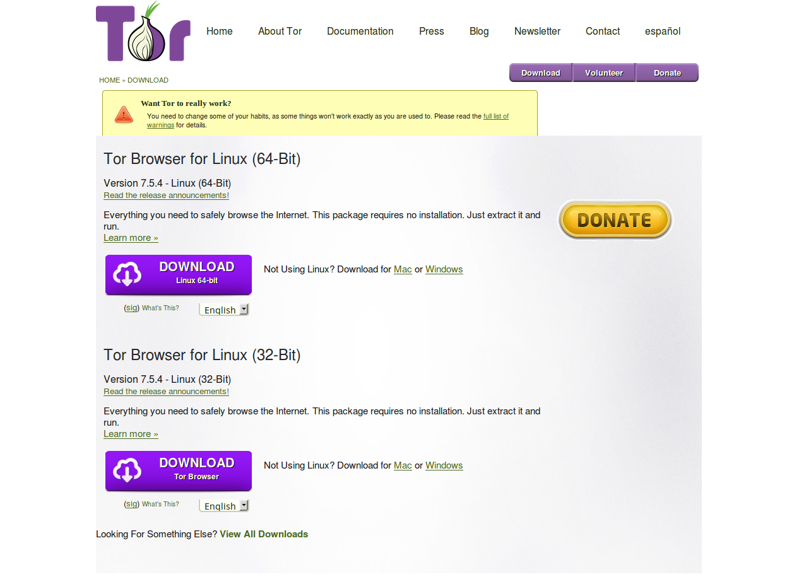
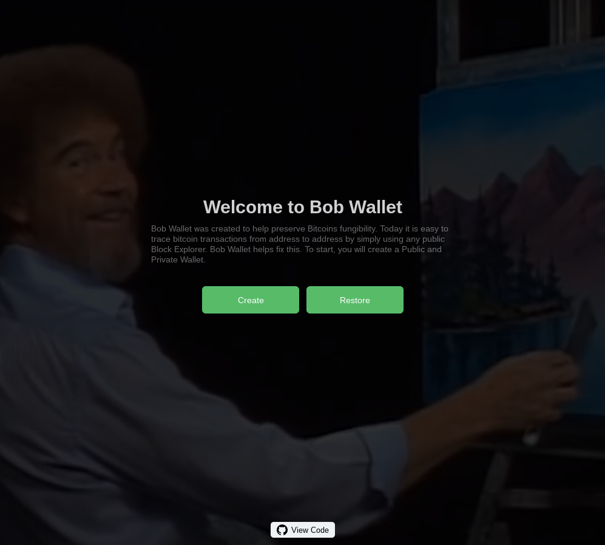
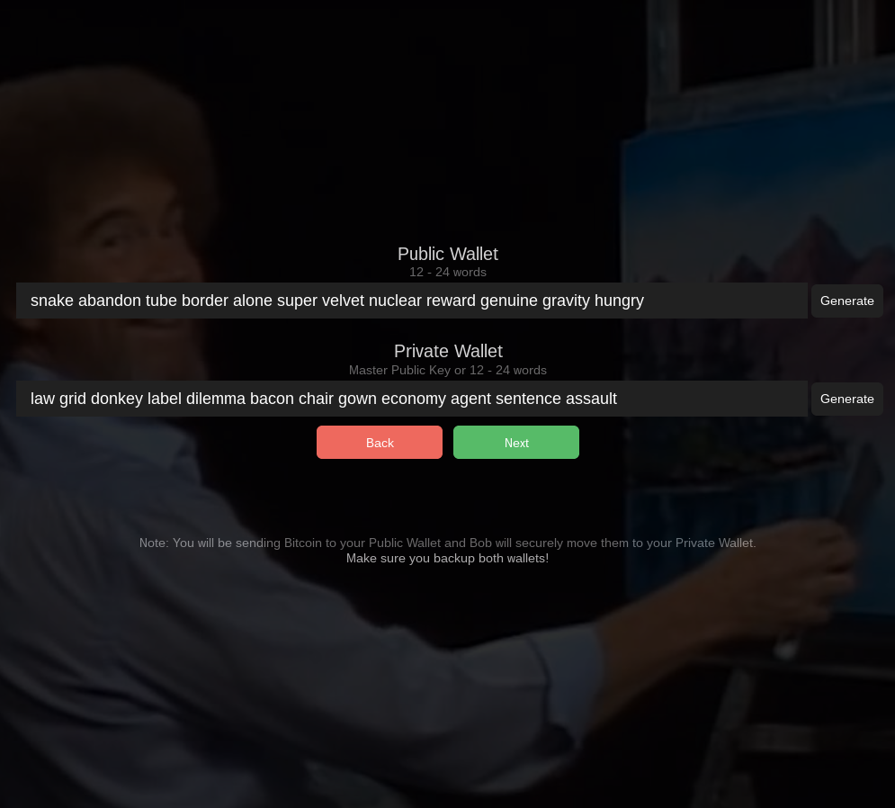

# Bob Wallet User Guide

**Documentation Version 1.0**  
**BobWallet Version 0.0.4**  

Note: The version of Bob Wallet that this guide is written for only runs on the bitcoin testnet.

## Step 1. Download and install the Tor Browser

_If you already have Tor Browser installed, you can skip to Step 2._

Tor Browser is needed to anonymize the connection between Bob Wallet and the mixing server. You can download Tor Browser [here](https://www.torproject.org/download/download-easy.html).

## Step 2. Start Tor Browser and open Bob Wallet

You can open Bob Wallet by visiting the website [http://bobwalletktuy6hp.onion](http://bobwalletktuy6hp.onion) OR [download Bob Wallet](https://github.com/BobWallet/BobWallet/archive/master.zip), unzip the BobWallet zip folder, and open (drag and drop) `bobwallet.html` from the unzipped folder into the Tor Browser.

## Step 3. Create a new Bob Wallet

Click the `Create` button to create a new Bob Wallet then click the `Generate` buttons to generate the seeds for your Public and Private wallets. The Public Wallet is where you will deposit the coins that you would like to mix. The Private Wallet is where the coins will end up after they have been mixed.

Save your wallet seeds in a text file, password manager, or by writing them down. Since these are testnet wallets, it isn't necessary to devote too much effort to securing the wallet seeds. Click `Next` then `Download Backup` to proceed to the next screen.

_The wallet seeds shown in the image below are only examples and should not be reused in your own wallet._

## Step 4. Deposit testnet bitcoin into your Public Wallet

Click the address shown on the Public Wallet tab of your Bob Wallet to copy the address to your clipboard. Visit [this testnet bitcoin faucet](https://testnet.manu.backend.hamburg/faucet), paste your address, then click `Give me some coins` to have testnet coins sent to your address. You may need to complete a CAPTCHA before the website will let you click the button to receive testnet bitcoins.

